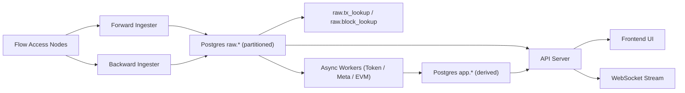
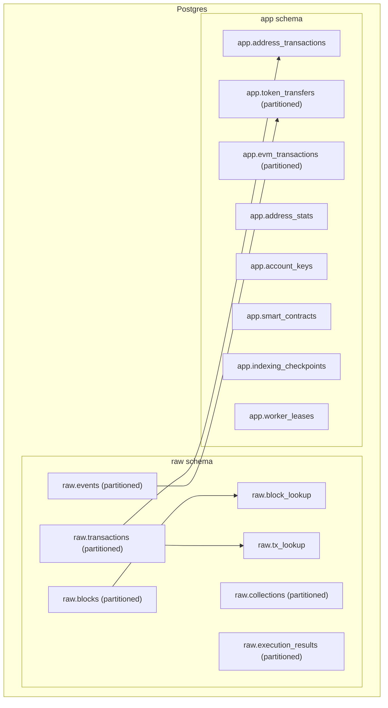
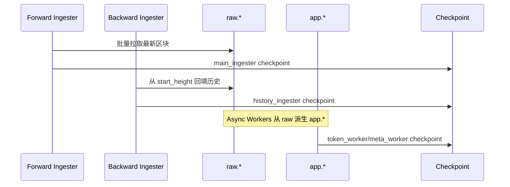
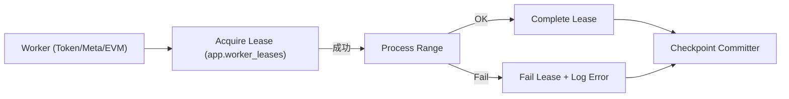
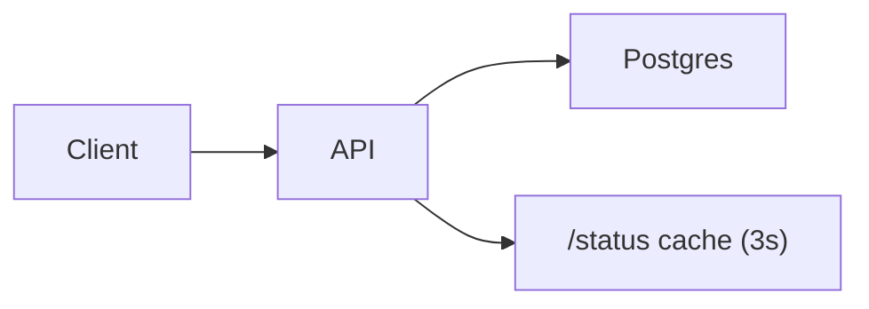
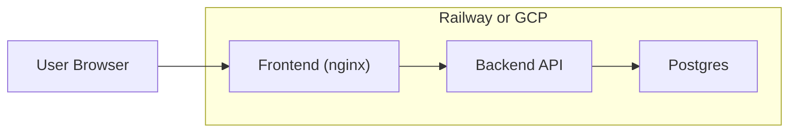

# FlowScan Clone 架构文档

**更新时间:** 2026-02-04

---

## 1. 目标与约束

- 目标: 面向 Flow 的区块链浏览器, 高吞吐索引 + 稳定查询 + 可扩展派生数据.
- 约束: 海量数据 (10TB+) 与高并发读写, 需要分区与分层设计, 优先保证原始数据完整.

---

## 2. 系统总览 (数据流)

---

## 3. 数据层分层与分区

关键点:
- raw.* 保存完整原始数据, app.* 保存派生数据, 避免查询对 raw 压力过大.
- 分区表使用 block_height 范围分区, 支撑 10TB+ 规模.
- lookup 表避免跨分区扫描.

---

## 4. 索引与回滚策略

回滚:
- 使用 MAX_REORG_DEPTH 作为安全边界.
- 回滚范围内 raw/app 同步清理, 避免派生数据漂移.

---

## 5. Async Worker 租约机制

说明:
- Lease 避免并发重复处理同一区间.
- 失败的 lease 会被 reclaim 重试.
- Checkpoint 只推进连续区间.

---

## 6. API 与分页策略

Cursor 分页:
- Blocks: `height`
- Transactions: `block_height:tx_index:tx_id`
- Address Tx: `block_height:tx_id`
- Token/NFT Transfers: `block_height:tx_id:event_index`

---

## 7. 部署拓扑 (Railway / GCP)

说明:
- 前端通过 nginx 反向代理 `/api` 与 `/ws`.
- GCP 推荐拆分 raw/app 或读写分离.

---

## 8. 关键参数与可调项

核心变量完整列表见: `DEPLOY_ENV.md`.

索引相关:
- `HISTORY_WORKER_COUNT`, `HISTORY_BATCH_SIZE`
- `LATEST_WORKER_COUNT`, `LATEST_BATCH_SIZE`
- `FLOW_RPC_RPS_PER_NODE`, `FLOW_RPC_BURST_PER_NODE`

派生相关:
- `TOKEN_WORKER_RANGE`, `META_WORKER_RANGE`
- `TOKEN_WORKER_CONCURRENCY`, `META_WORKER_CONCURRENCY`

DB 相关:
- `DB_MAX_OPEN_CONNS`, `DB_MAX_IDLE_CONNS`

---

## 9. 未来演进

- EVM Worker 完整写入 `app.evm_transactions`
- Token / NFT 全局列表与详情
- 统计/日报数据链路
- raw/app 物理拆分, 压缩与冷热分层
