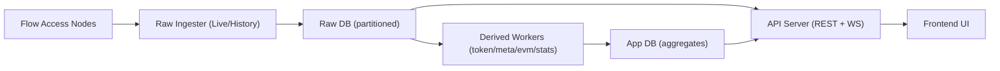
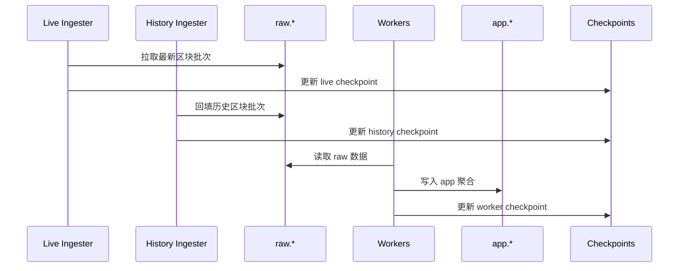
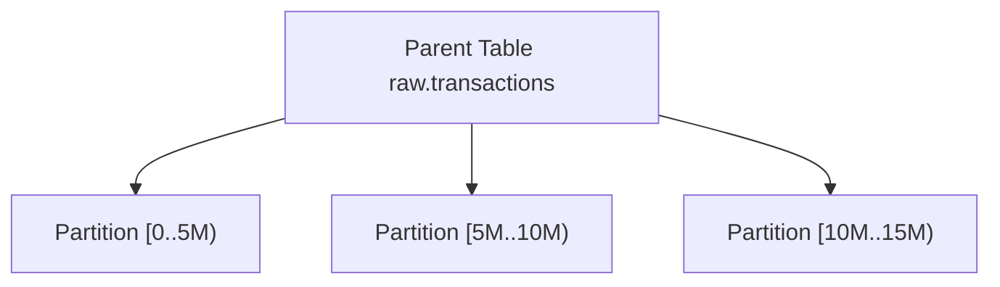

# FlowScan Clone 架构文档

更新时间：2026-02-04

## 1. 目标与边界
- 目标：为 Flow 链提供高吞吐索引 + 低延迟查询 + 可扩展派生数据的区块浏览器。
- 数据规模：10TB+ 级别，历史回填与实时索引并行。
- 核心原则：Raw 数据完整保真，App 层聚合面向查询。

## 2. 系统总览

## 3. 运行模块与职责
- Raw Ingester（Live）：追最新区块，保证 head 附近及时性。
- Raw Ingester（History）：从 `start_height` 回填，覆盖全历史。
- Derived Workers：从 raw.* 派生 app.*（token/nft/meta/evm/stats 等）。
- Committer：推进 `app.indexing_checkpoints`，保证断点续跑与幂等。
- API Server：REST + WebSocket，读取 raw/app 并输出统一分页。
- Frontend：Vite + UI 页面，消费 API/WS。

## 4. 数据流与索引模式

## 5. 数据库布局与分区策略
Raw/App 双层设计。Raw 只追加写入，App 为查询聚合层。

### Raw Schema（主表）
- `raw.blocks`（按 height 分区）
- `raw.transactions`（按 block_height 分区）
- `raw.events`（按 block_height 分区）
- `raw.collections`（按 block_height 分区）
- `raw.execution_results`（按 block_height 分区）
- `raw.block_lookup`（block_id -> height 快查）
- `raw.tx_lookup`（tx_id -> height 快查）
- `raw.indexing_errors`（错误去重与审计）

### App Schema（派生表）
- `app.address_transactions`（地址关联交易）
- `app.token_transfers`（FT/NFT 转移）
- `app.nft_transfers`（NFT 细分表）
- `app.address_stats`（地址统计）
- `app.account_keys`（公钥映射）
- `app.smart_contracts`（合约目录）
- `app.indexing_checkpoints`（断点）
- `app.worker_leases`（租约并发控制）
- `app.evm_transactions`（EVM 派生）

### 分区策略

- 分区键：`block_height` / `height`。
- 典型分区粒度：5,000,000（blocks/tx/collections/execution_results），10,000,000（events/transfers/evm）。
- 关键优化：lookup 表避免跨分区全扫。
- 推荐使用 `raw.create_partitions()` 动态创建分区并提前预热 1~2 个分区。

## 6. Resumability（断点与幂等）
- `app.indexing_checkpoints`：记录 worker 最新高度，支持重启续跑。
- `app.worker_leases`：租约控制并发区间，避免重复处理。
- Upsert/幂等写入：重复数据不破坏一致性。
- `raw.indexing_errors`：错误去重与溯源。

## 7. Reorg 与回滚
- 通过 `MAX_REORG_DEPTH` 进行回滚边界保护。
- 回滚范围内 raw/app 同步清理，保证派生一致性。

## 8. API 与分页策略
- REST + WebSocket。
- 统一 Cursor 分页，避免 offset 扫描。
- Cursor 示例（Blocks）：`height`
- Cursor 示例（Transactions）：`block_height:tx_index:tx_id`
- Cursor 示例（Address Tx）：`block_height:tx_id`
- Cursor 示例（Token/NFT Transfers）：`block_height:tx_id:event_index`

## 9. 环境变量（关键组）
完整列表见 `DEPLOY_ENV.md`，这里列常用组。

### 基础服务
- `PORT`
- `DATABASE_URL`
- `REDIS_URL`（如启用缓存）

### Flow 节点与速率
- `FLOW_ACCESS_NODES`
- `FLOW_RPC_RPS_PER_NODE`
- `FLOW_RPC_BURST_PER_NODE`

### Live/History 索引
- `LATEST_WORKER_COUNT`
- `LATEST_BATCH_SIZE`
- `HISTORY_WORKER_COUNT`
- `HISTORY_BATCH_SIZE`

### 派生 Worker
- `TOKEN_WORKER_CONCURRENCY`
- `TOKEN_WORKER_RANGE`
- `META_WORKER_CONCURRENCY`
- `META_WORKER_RANGE`

### DB 连接池
- `DB_MAX_OPEN_CONNS`
- `DB_MAX_IDLE_CONNS`

## 10. 扩展性建议
- 新增派生模块时优先写入 app.*，避免 raw 过载。
- 长期报表类数据用日级聚合表，缩短查询时间。
- 大规模数据建议做冷热分层与历史归档。

## 11. 部署拓扑（Railway / GCP）

- Railway：单实例可快速验证；后续可扩展为多实例分工。
- GCP：建议将 raw/app 拆分或读写分离。
