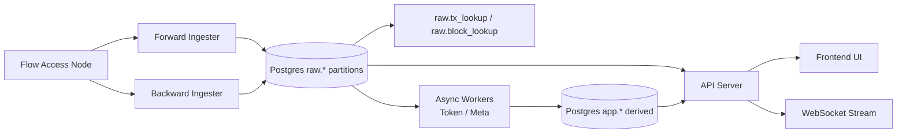
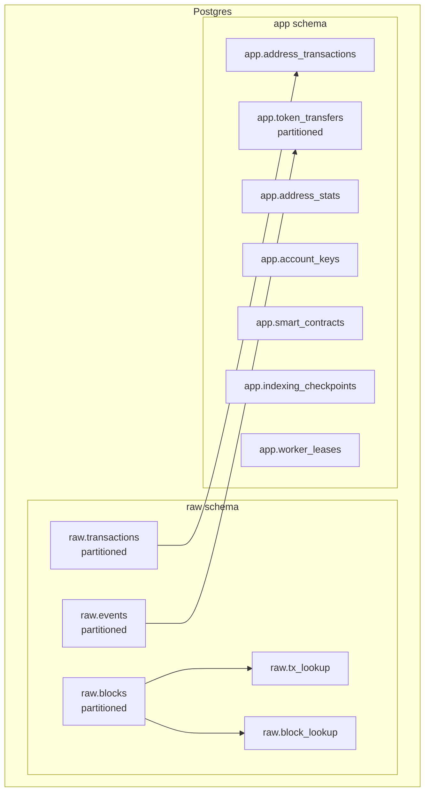

# FlowScan Clone 架构文档

**更新时间:** 2026-02-03

---

## 1. 目标与约束

- **目标**：构建 Flow 区块链浏览器，支持高吞吐索引、稳定查询与可扩展派生数据。
- **约束**：海量数据（10TB+ 级）与高并发读写，优先考虑分区与分层架构。

---

## 2. 系统全景（数据流）



**说明**：
- `raw.*` 保存完整原始数据，优先保证索引稳定与可回放。
- `app.*` 保存派生数据（统计、地址交易、token/NFT 转账等）。

---

## 3. 数据层（Raw/App 分层 + 分区）



**关键点**：
- **分区**：`raw.blocks / raw.transactions / raw.events / app.token_transfers`
- **Lookup**：ID 查询直接走 `raw.tx_lookup / raw.block_lookup`，避免全表扫描
- **派生**：由 Worker 异步从 raw 生成 app

---

## 4. 写入与回滚策略

- **Ingester** 仅写 `raw.*`，确保核心数据完整
- **派生写入** 由 Worker 异步完成，可在流量低时启用
- **Reorg 回滚**
  - 使用 `MAX_REORG_DEPTH` 设置安全边界
  - 回滚 `raw.*` 和 `app.*` 对应区块高度以上数据

---

## 5. API 与分页策略

- **Cursor 分页优先**，避免大 offset 带来的性能问题

**Cursor 格式**
- Blocks: `height`
- Transactions: `block_height:tx_index:tx_id`
- Address Tx: `block_height:tx_id`
- Token/NFT Transfers: `block_height:tx_id:event_index`

**主要端点**
- `/blocks`, `/transactions`, `/accounts/:address/transactions`
- `/accounts/:address/token-transfers`
- `/accounts/:address/nft-transfers`
- `/status`, `/health`

---

## 6. 部署拓扑（Railway / GCP）

```mermaid
flowchart LR
  subgraph Railway_or_GCP
    FE[Frontend (nginx)] --> API[Backend API]
    API --> DB[(Postgres)]
  end

  User[User Browser] --> FE
```

**说明**：
- Railway: 前端 nginx 通过内部网络转发 `/api` 和 `/ws` 到 backend
- GCP: 推荐将 backend 与 Postgres 分开部署，后续可物理拆分 raw/app

---

## 7. 运行开关（关键环境变量）

完整列表见：`DEPLOY_ENV.md`

核心控制项：
- `ENABLE_DERIVED_WRITES` / `ENABLE_TOKEN_WORKER` / `ENABLE_META_WORKER`
- `FLOW_RPC_RPS` / `FLOW_RPC_BURST`
- `MAX_REORG_DEPTH`

---

## 8. 下一步演进建议

- **EVM Worker**：把 EVM 解析逻辑迁到异步 Worker
- **Token/NFT 全局页**：增加 Token/NFT 列表与详情
- **物理拆分**：raw/app 独立数据库
- **Vite Proxy**：本地开发增加 `/api` 代理

