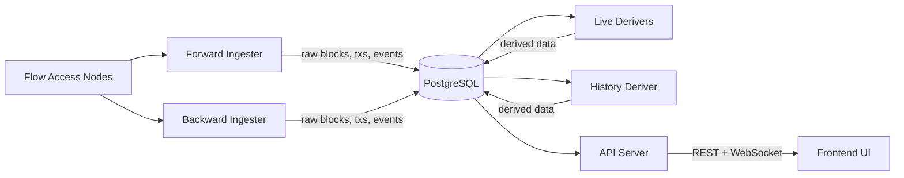
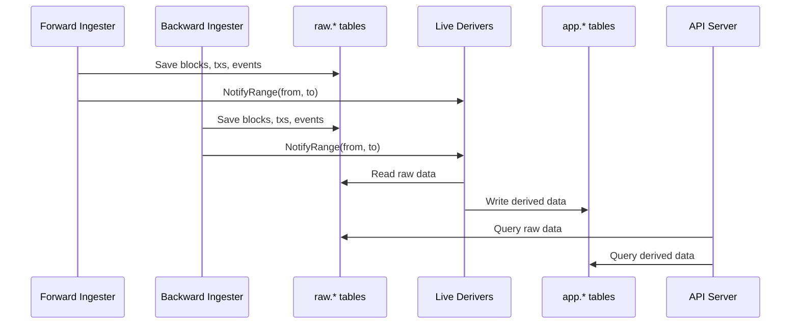
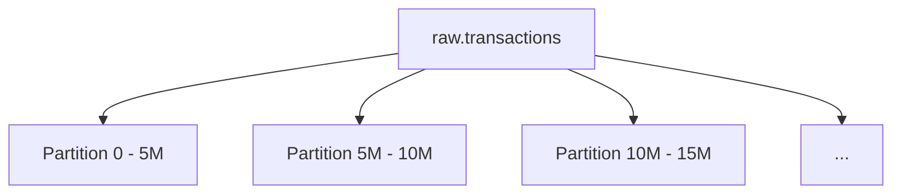

FlowIndex follows a **dual ingester + deriver** architecture designed for high-throughput blockchain indexing with near-real-time derived data.

## System Overview

## Dual Ingester Pattern

Two independent ingesters run concurrently, each optimized for its workload:

### Forward Ingester (`main_ingester`)

Tracks the chain head in real time. Processes blocks in **ascending** order.

1. Reads its checkpoint from the database
2. Fetches the latest sealed block height from a Flow Access Node
3. Fills a batch using a concurrent worker pool
4. Performs **reorg detection** by verifying parent hash continuity
5. Saves the batch atomically in a single database transaction
6. Broadcasts new blocks and transactions via WebSocket
7. Triggers the forward Live Deriver for near-real-time derived data

### Backward Ingester (`history_ingester`)

Backfills historical data in **descending** order, silently filling the chain from the present back to genesis.

1. Walks backwards from its checkpoint
2. Handles **spork boundaries** automatically -- when a node returns "not found", the ingester adjusts the floor to the spork root height
3. Supports per-spork node configuration via `FLOW_HISTORIC_ACCESS_NODES`
4. No WebSocket broadcasts (silent backfill)
5. Triggers the history Live Deriver for immediate derived data

## Data Flow

## Derivers and Workers

Derivers transform raw blockchain data into queryable derived tables. They operate in two phases per chunk of blocks:

### Phase 1 -- Independent Processors (parallel)

| Worker | Purpose | Output Tables |
|--------|---------|--------------|
| `token_worker` | Parse FT/NFT events into transfers | `ft_transfers`, `nft_transfers`, `ft_tokens`, `nft_collections` |
| `evm_worker` | Decode EVM transactions from Flow events | `evm_tx_hashes` |
| `tx_contracts_worker` | Extract contract imports, tag transactions | `tx_contracts`, `tx_tags` |
| `accounts_worker` | Catalog accounts from creation events | `accounts`, `coa_accounts` |
| `meta_worker` | Build address-transaction index, extract keys | `address_transactions`, `account_keys`, `smart_contracts` |
| `tx_metrics_worker` | Compute per-transaction metrics | `tx_metrics` |
| `staking_worker` | Parse staking and epoch events | `staking_events`, `staking_nodes`, `epoch_stats` |
| `defi_worker` | Parse DEX swap events | `defi_events`, `defi_pairs` |

### Phase 2 -- Token-Dependent Processors (parallel, after Phase 1)

| Worker | Purpose | Output Tables |
|--------|---------|--------------|
| `ft_holdings_worker` | Update FT balances from transfers | `ft_holdings` |
| `nft_ownership_worker` | Update NFT ownership from transfers | `nft_ownership` |
| `daily_balance_worker` | Aggregate daily FT deltas | `daily_balances` |

### Queue-Based Workers (independent)

These operate outside the deriver pipeline, finding their own work from derived tables:

| Worker | Purpose |
|--------|---------|
| `nft_item_metadata_worker` | Fetch per-NFT metadata via Cadence scripts |
| `nft_ownership_reconciler` | Verify NFT ownership against chain state |
| `token_metadata_worker` | Fetch on-chain FT/NFT collection metadata |

## Live Deriver vs. History Deriver

| | Live Deriver | History Deriver |
|---|---|---|
| **Trigger** | Ingester callback on each batch | Periodic background scan |
| **Chunk size** | 10 blocks (configurable) | 1,000 blocks (configurable) |
| **Latency** | Near-real-time (~1 second) | Background safety net |
| **Instances** | Two (forward + history) | One |
| **Purpose** | Primary processing path | Catch missed ranges |

The **forward Live Deriver** is triggered by the forward ingester after each batch commit, ensuring derived data is available within seconds of a block being sealed.

The **history Live Deriver** is triggered by the backward ingester, processing newly backfilled blocks immediately.

The **History Deriver** runs as a safety net, scanning for any raw blocks that were not yet processed by the derivers.

## Database Schema

The database uses a dual-layer design:

### Raw Layer (`raw.*`)

Stores blockchain data exactly as received from Flow Access Nodes. Append-only and partitioned by block height.

| Table | Contents |
|-------|----------|
| `raw.blocks` | Block headers (height, ID, parent ID, timestamp, tx/event counts) |
| `raw.transactions` | Full transaction data (script, arguments, authorizers, status) |
| `raw.events` | All events emitted by transactions |
| `raw.tx_lookup` | Transaction ID to block height mapping |
| `raw.block_lookup` | Block ID to height mapping |
| `raw.scripts` | Deduplicated transaction scripts (script_hash to script_text) |

### App Layer (`app.*`)

Stores worker-derived projections optimized for queries.

| Table | Contents |
|-------|----------|
| `app.ft_transfers` | Fungible token transfers (sender, receiver, amount, token) |
| `app.nft_transfers` | NFT transfers (sender, receiver, collection, NFT ID) |
| `app.ft_holdings` | Current FT balances per account per token |
| `app.nft_ownership` | Current NFT ownership |
| `app.accounts` | Known accounts with creation metadata |
| `app.smart_contracts` | Deployed contracts with code and metadata |
| `app.account_keys` | Flow account public keys |
| `app.address_transactions` | Address-to-transaction index for fast lookups |
| `app.evm_tx_hashes` | Cadence transaction to EVM hash mappings |
| `app.staking_nodes` | Staking node state and delegation info |
| `app.defi_pairs` | DEX trading pairs and liquidity pools |
| `app.indexing_checkpoints` | Resumability state for all workers |
| `app.worker_leases` | Lease-based concurrency control |

### Partitioning Strategy

Raw tables are range-partitioned by `block_height` with partition sizes of 5-10 million rows. Lookup tables (`tx_lookup`, `block_lookup`) avoid expensive cross-partition scans.

## Resumability

All ingesters and workers track progress via `app.indexing_checkpoints`. On restart, each component resumes from its last committed checkpoint. Writes are idempotent (upsert-based), so retries are safe.

Workers use a lease mechanism (`app.worker_leases`) to prevent duplicate processing across concurrent instances. Failed leases are automatically retried up to 20 times before being flagged for manual intervention.

## Reorg Handling

The forward ingester performs parent hash verification on each batch. If a chain reorganization is detected:

1. Affected blocks are surgically deleted (not truncated)
2. Worker checkpoints are clamped to the rollback height
3. Worker leases overlapping the rollback range are deleted for re-derivation
