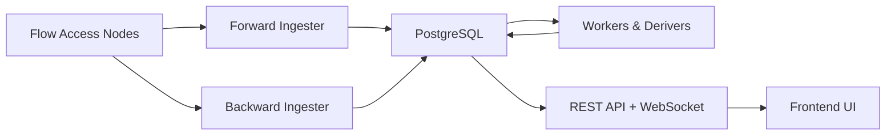

FlowIndex is a full-stack blockchain explorer and indexer purpose-built for the [Flow blockchain](https://flow.com). It provides real-time block ingestion, comprehensive historical backfill, a rich REST API, WebSocket live updates, and a modern frontend UI.

## Core Features

- **Real-time block indexing** -- A forward ingester tracks the chain head and indexes new blocks within seconds of finalization.
- **Historical backfill** -- A backward ingester fills the complete chain history, with spork-aware node routing for seamless cross-spork coverage.
- **Flow-EVM support** -- Automatic detection and indexing of EVM transactions embedded in Flow, including EVM hash mapping, sender/receiver extraction, and gas tracking.
- **WebSocket live updates** -- Frontend clients receive new blocks and transactions in real time via a WebSocket broadcast hub.
- **REST API** -- A comprehensive API covering blocks, transactions, accounts, fungible tokens, NFTs, contracts, staking, DeFi, and analytics.
- **17+ background workers** -- Specialized processors derive token transfers, NFT ownership, account metadata, staking events, DeFi swaps, daily statistics, and more.
- **Cursor-based pagination** -- All list endpoints use efficient cursor pagination to avoid expensive offset scans.
- **Partitioned storage** -- Raw blockchain data is stored in PostgreSQL range-partitioned tables for scalable querying at terabyte scale.

## Tech Stack

| Layer | Technology |
|-------|-----------|
| Backend | Go 1.24+, PostgreSQL (pgx), Flow SDK, Gorilla Mux/WebSocket |
| Frontend | React 19, TanStack Start (SSR via Nitro), TanStack Router, TypeScript |
| UI | TailwindCSS, Shadcn/UI (Radix), Recharts, Framer Motion, Lucide icons |
| Auth | Self-hosted Supabase (GoTrue + PostgREST) |
| Deployment | Docker, Docker Compose |

## Architecture at a Glance



The system follows a **dual ingester + deriver** pattern:

1. **Ingesters** fetch raw blocks, transactions, and events from Flow Access Nodes and store them in partitioned `raw.*` tables.
2. **Derivers and workers** read raw data and produce derived tables in `app.*` -- token transfers, account metadata, NFT ownership, staking state, and more.
3. **The API server** queries both raw and app tables to serve the frontend and external consumers.

See the [Architecture](/docs/flowindex/architecture) page for a detailed breakdown.

## Project Structure

```
backend/         Go indexer + API server
frontend/        TanStack Start SSR app (React 19, TypeScript)
supabase/        Self-hosted Supabase auth stack
devportal/       Developer portal (Fumadocs + Scalar)
scripts/         Utility scripts
```

## Next Steps

- [Getting Started](/docs/flowindex/getting-started) -- Run FlowIndex locally with Docker Compose
- [Architecture](/docs/flowindex/architecture) -- Understand the ingestion pipeline and worker system
- [API Reference](/docs/flowindex/api-reference) -- Explore REST endpoints and WebSocket events
- [Configuration](/docs/flowindex/guides/configuration) -- Environment variables reference
- [EVM Support](/docs/flowindex/guides/evm-support) -- How Flow-EVM transactions are indexed
