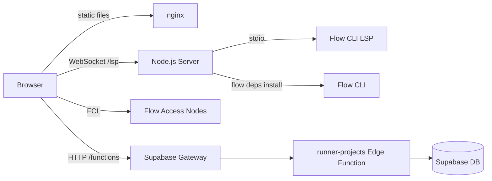

Run is composed of a static frontend SPA, a Node.js backend server, and a Supabase edge function for project persistence. In production, nginx ties them together and supervisord manages the processes.

## System Overview

## Frontend

The frontend is a Vite-built React 19 SPA with two main routes:

- `/editor` -- The primary Cadence editor and execution environment
- `/deploy/*` -- The contract deploy dashboard

### Editor

The editor uses Monaco Editor with a custom Cadence TextMate grammar for syntax highlighting. It supports:

- **Multi-file projects** with a file explorer sidebar and tabbed editing
- **Diff view** for comparing code changes (used during GitHub sync)
- **Parameter detection** that parses `fun main(...)` or `transaction(...)` signatures and renders input fields automatically
- **Code type detection** that determines whether the active file is a script, transaction, or contract based on its content

### Execution Engine

The execution engine (`src/flow/execute.ts`) handles three types of operations:

1. **Scripts** -- Read-only queries executed via `fcl.query()`. These do not require wallet authentication.
2. **Transactions** -- State-changing operations executed via `fcl.mutate()`. These require a connected wallet or custodial key for signing.
3. **Contract deployments** -- A specialized transaction flow that encodes the contract source as hex and submits an add-or-update transaction. It auto-detects whether the contract already exists on the target account.

All execution goes directly from the browser to Flow Access Nodes via FCL. The backend server is not involved in script or transaction execution.

### Wallet and Signing

Run supports multiple signing methods:

| Method | Description |
|--------|-------------|
| **FCL wallet** | Connect any FCL-compatible wallet (Lilico, Blocto, etc.) via the Discovery UI |
| **Custodial keys** | Use locally-managed or server-stored keys with custom `signingFunction` |
| **Passkey signing** | WebAuthn-backed keys for passwordless transaction signing |

The `SignerSelector` component lets users choose which signing method and key to use for each transaction.

### Network Configuration

FCL is configured per-network with pre-mapped contract addresses for common Flow contracts (FungibleToken, NonFungibleToken, FlowToken, EVM, etc.). The editor supports switching between **mainnet** and **testnet** at any time, which reconfigures FCL and reconnects the LSP.

## Backend Server

The Node.js backend (`runner/server/`) runs two services in a single process:

### WebSocket LSP Proxy (port 3002)

The LSP proxy bridges the browser Monaco editor to a native Flow CLI Cadence Language Server process. Each network (mainnet/testnet) gets its own LSP instance.

**Connection lifecycle:**

1. Browser opens a WebSocket to `/lsp`
2. Browser sends `{ type: "init", network: "mainnet" }` to select the target network
3. Server returns `{ type: "ready" }` once the LSP client is initialized
4. Browser sends standard LSP JSON-RPC messages (`textDocument/didOpen`, `textDocument/completion`, etc.)
5. Server translates URIs between the browser's virtual filesystem and the server's dependency workspace, then forwards messages to the LSP process
6. LSP responses are translated back and sent to the browser

**Key capabilities:**

- **Automatic dependency resolution** -- When the editor opens a file with `import X from 0xABCDEF`, the server intercepts the message, runs `flow dependencies install` to fetch the contract source, and rewrites the import to a string-based import that the LSP understands
- **Go-to-definition fallback** -- If the native LSP returns an invalid definition result for imported symbols, the server performs its own symbol lookup across cached dependency sources
- **Shared LSP instances** -- All browser connections to the same network share a single LSP process. Per-connection state (open documents, resolved dependencies) is tracked independently
- **Deploy event subscriptions** -- WebSocket connections can subscribe to `subscribe:deploy` messages to receive real-time deployment status updates

### HTTP Server (port 3003)

The Express HTTP server provides endpoints for GitHub App integration:

- OAuth callback handling for GitHub App installation
- Repository file listing and content retrieval via the GitHub API
- Webhook processing for deployment events
- Repository secret management for automated deployments

## Dependency Workspace

The `DepsWorkspace` class manages a per-network temporary directory that acts as a Flow project. It:

1. Creates a `flow.json` with network configuration on initialization
2. Pre-installs core Flow contracts (FungibleToken, NonFungibleToken, FlowToken, MetadataViews, EVM, etc.) in the background
3. Installs additional contracts on-demand when the editor imports them
4. Caches installed contracts across connections -- once a contract is fetched, it is available to all users on that network
5. Rewrites address-based imports (`import X from 0xABCDEF`) to string-based imports (`import "X"`) in cached files so the LSP resolves them correctly

## Project Persistence

Cloud project storage is handled by the `runner-projects` Supabase edge function (Deno). It exposes a single POST endpoint that dispatches based on an `endpoint` field in the request body:

| Endpoint | Auth | Description |
|----------|------|-------------|
| `/projects/list` | Required | List the authenticated user's projects |
| `/projects/get` | Public projects readable by anyone | Fetch a project and its files by slug |
| `/projects/save` | Required | Create or update a project (upserts files) |
| `/projects/delete` | Required | Delete a project and all its files |
| `/projects/fork` | Required | Fork a public project into the user's account |

Projects are stored across two database tables:

- **`user_projects`** -- Project metadata (name, slug, network, visibility, active file, open files, folders)
- **`project_files`** -- Individual file content keyed by `(project_id, path)`

Each project gets a unique slug used for shareable URLs.

## GitHub Integration

The GitHub integration enables connecting a Runner project to a GitHub repository for version-controlled contract deployment:

1. **Connect** -- Install the GitHub App on a repository and link it to a Runner project
2. **Environments** -- Configure deployment environments (e.g., testnet, mainnet) with target Flow addresses and network settings
3. **Secrets** -- Store Flow account private keys as GitHub repository secrets for automated signing
4. **Deploy** -- Push commits to trigger deployment workflows that compile and deploy contracts to the configured environments
5. **Status** -- Real-time deployment status updates streamed via WebSocket

## Production Architecture

In production, the Runner container runs three processes managed by supervisord:

1. **nginx** -- Serves the static frontend build, proxies `/lsp` to the Node.js server, proxies `/auth/` to GoTrue, and proxies `/functions/` to the Supabase gateway
2. **Node.js server** -- Runs the LSP WebSocket proxy and GitHub HTTP API
3. **Flow CLI** -- Spawned as a child process by the Node.js server for each network's LSP instance

The container includes the Flow CLI binary for running the Cadence Language Server and resolving contract dependencies.
