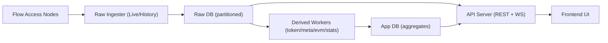
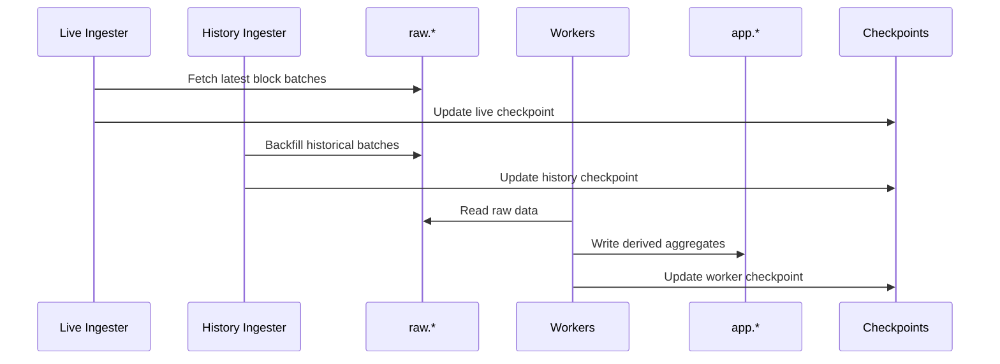
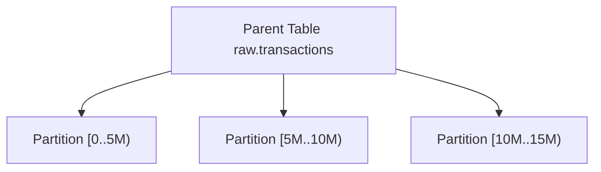
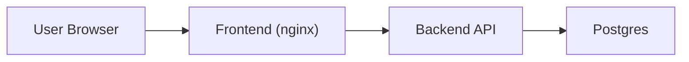

# FlowScan Clone Architecture

**Last updated:** 2026-02-12

## 1. Goals and Scope
- **Goal:** High-throughput indexing, low-latency queries, and extensible derived data for Flow.
- **Scale target:** 10TB+ with concurrent live + historical backfill.
- **Core principle:** Preserve raw data fully; aggregate in the app layer for fast queries.
- Backend file ownership map: `docs/architecture/BACKEND_STRUCTURE.md`

## 2. System Overview


## 3. Runtime Modules and Responsibilities
- **Raw Ingester (Live):** Tracks the chain head and keeps the latest blocks fresh.
- **Raw Ingester (History):** Backfills from `start_height` to cover full history.
- **Derived Workers:** Read `raw.*` and write `app.*` (token/nft/meta/evm/stats, etc).
- **Committer:** Advances `app.indexing_checkpoints` for resumability and idempotency.
- **API Server:** REST + WebSocket, reading from raw/app with unified pagination.
- **Frontend:** Vite UI consuming API/WS.

## 4. Data Flow and Indexing Mode


## 5. Database Layout and Partitioning
Raw/App dual-layer design. Raw is append-only; App is query-optimized.

### Raw Schema (Primary Tables)
- `raw.blocks` (partition by height)
- `raw.transactions` (partition by block_height)
- `raw.events` (partition by block_height)
- `raw.collections` (partition by block_height)
- `raw.execution_results` (partition by block_height)
- `raw.block_lookup` (block_id -> height fast lookup)
- `raw.tx_lookup` (tx_id -> height fast lookup)
- `raw.scripts` (script_hash -> script_text de-dup)
- `raw.indexing_errors` (dedupe + audit)

### App Schema (Derived Tables)
- `app.address_transactions` (address-to-tx mapping)
- `app.token_transfers` (FT/NFT transfers)
- `app.nft_transfers` (NFT-only table)
- `app.address_stats` (address stats)
- `app.account_keys` (Flow account keys state, keyed by `(address, key_index)`; supports publicKey -> address lookup)
- `app.smart_contracts` (contract catalog)
- `app.indexing_checkpoints` (resumability)
- `app.worker_leases` (lease-based concurrency)
- `app.evm_transactions` (EVM-derived)
- `app.evm_tx_hashes` (Cadence tx -> multiple EVM hash mappings)

### Placement Rule (Raw vs App)
- `raw.*` stores direct RPC fields with minimal interpretation.
- `app.*` stores worker-derived projections and query models.
- Event-specific parsing should write to dedicated `app.*` tables, while full event payload remains in `raw.events`.
- `raw.tx_lookup` is Flow tx lookup only; EVM hash mapping belongs in `app.evm_tx_hashes`.

### Partitioning Strategy

- Partition key: `block_height` / `height`.
- Typical sizes: 5,000,000 (blocks/tx/collections/execution_results), 10,000,000 (events/transfers/evm).
- Key optimization: lookup tables avoid cross-partition scans.
- Recommended: `raw.create_partitions()` with 1–2 partitions lookahead.

## 6. Resumability and Idempotency
- `app.indexing_checkpoints` records latest heights per worker.
- `app.worker_leases` provides range leasing to avoid duplicate processing.
- Upsert/idempotent writes prevent corruption on retries.
- `raw.indexing_errors` for dedupe + audit.

## 7. Worker Dependencies and Error Recovery
See `docs/architecture/indexer-reliability.md` for full details.

### Dependency Chain
Downstream workers check upstream checkpoints before processing:
```
raw ingester → {token, evm, meta, accounts, tx_metrics}
token_worker → {ft_holdings, nft_ownership, tx_contracts, token_metadata}
```

### Error Recovery Pipeline
1. **Worker failure** → lease marked FAILED, logged to `raw.indexing_errors`.
2. **Lease reaper** (every 30s) → marks expired ACTIVE leases as FAILED.
3. **Reclaim** → next worker cycle picks up FAILED lease (up to 20 attempts).
4. **Dead letter** (every 60s) → CRITICAL alert for leases with attempt >= 20.
5. **LiveDeriver retry** → failed processor+range retried 3× with exponential backoff.
6. **Gap detection** (every 60s) → finds missing ranges between COMPLETED leases.

## 8. Reorg Handling
- `MAX_REORG_DEPTH` guards rollback boundaries.
- Surgical rollback: precise DELETE by height, not TRUNCATE.
- Worker checkpoints clamped with `LEAST()` rather than zeroed.
- Worker leases overlapping rollback range deleted for re-derivation.

## 8. API and Pagination
- REST + WebSocket.
- Cursor pagination (avoid offset scans).
- Cursor examples:
  - Blocks: `height`
  - Transactions: `block_height:tx_index:tx_id`
  - Address Tx: `block_height:tx_id`
  - Token/NFT Transfers: `block_height:tx_id:event_index`

## 9. Environment Variables (Key Groups)
Full list in `docs/operations/deploy-env.md`.

### Core
- `PORT`
- `DB_URL`

### Flow Nodes and Rate Limits
- `FLOW_ACCESS_NODES`
- `FLOW_HISTORIC_ACCESS_NODES` (optional, recommended for full history across sporks)
- `FLOW_RPC_RPS_PER_NODE`
- `FLOW_RPC_BURST_PER_NODE`

### Live/History Ingestion
- `LATEST_WORKER_COUNT`
- `LATEST_BATCH_SIZE`
- `HISTORY_WORKER_COUNT`
- `HISTORY_BATCH_SIZE`

### Derived Workers
- `TOKEN_WORKER_CONCURRENCY`
- `TOKEN_WORKER_RANGE`
- `META_WORKER_CONCURRENCY`
- `META_WORKER_RANGE`

### DB Pool
- `DB_MAX_OPEN_CONNS`
- `DB_MAX_IDLE_CONNS`

### Storage Tuning
- `TX_SCRIPT_INLINE_MAX_BYTES` (optional)
  - If `>0`, store `raw.transactions.script` inline when small.
  - Otherwise store `script_hash` and resolve via `raw.scripts` on-demand.

## 10. Extensibility Guidance
- Add new derived modules in `app.*` to avoid raw overload.
- Use daily aggregates for long-range analytics.
- For very large scale, consider hot/cold tiering and archival.

## 11. Deployment Topology (Railway / GCP)

- **Railway:** Single instance for rapid validation; scale out later.
- **GCP:** Split raw/app or read/write tiers when needed.
