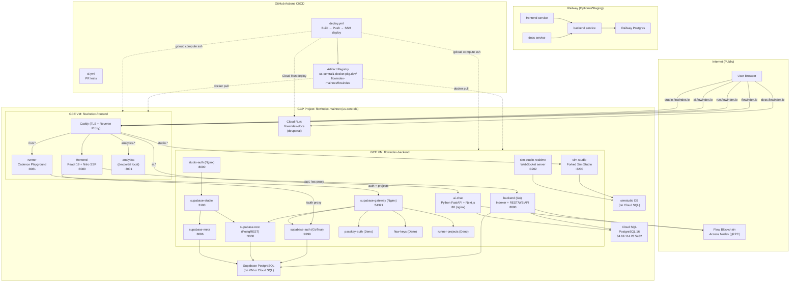
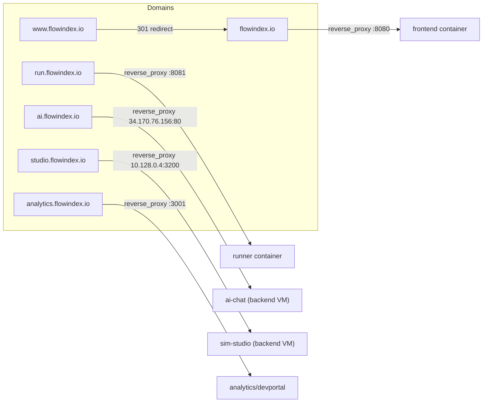
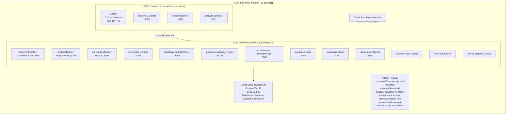
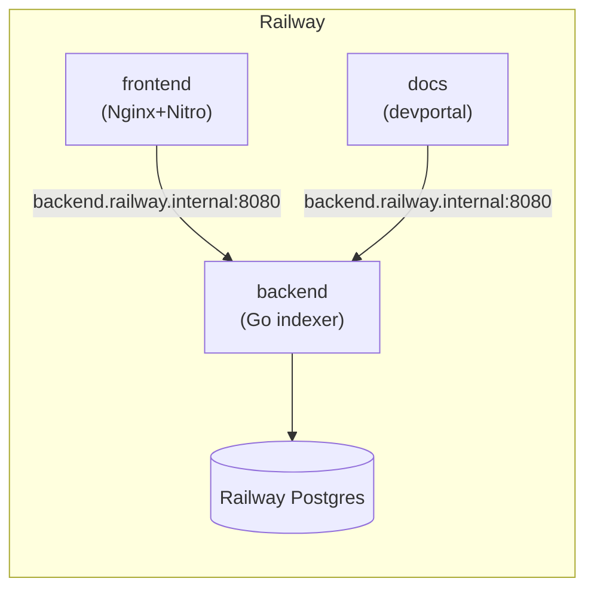
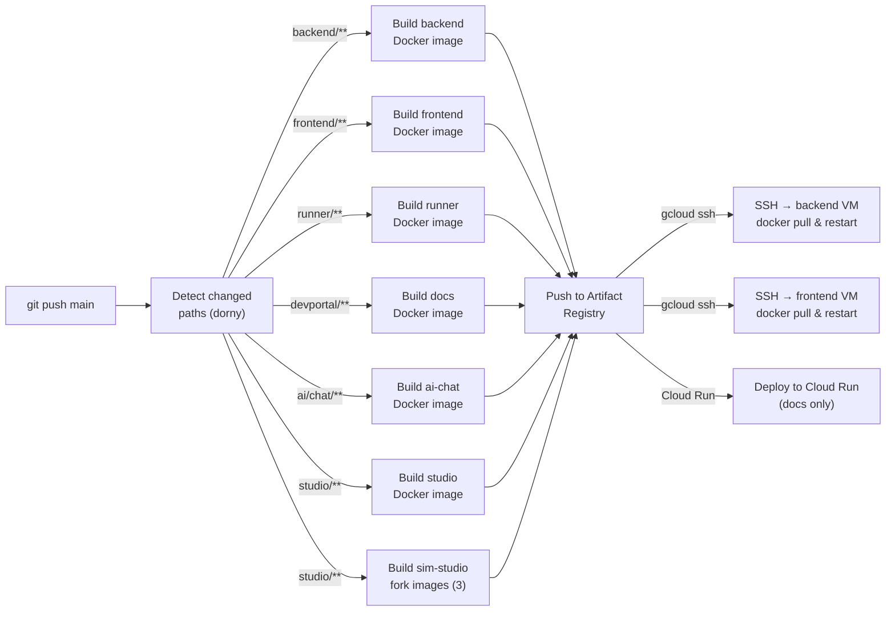
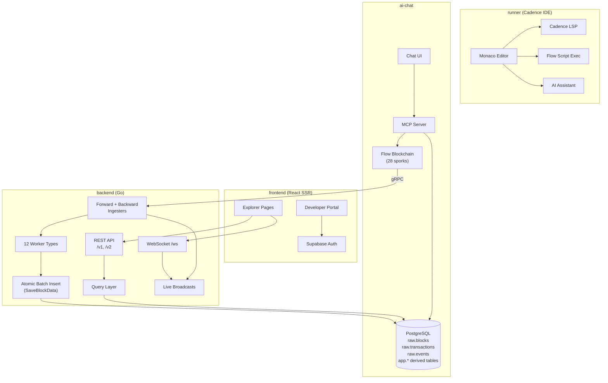
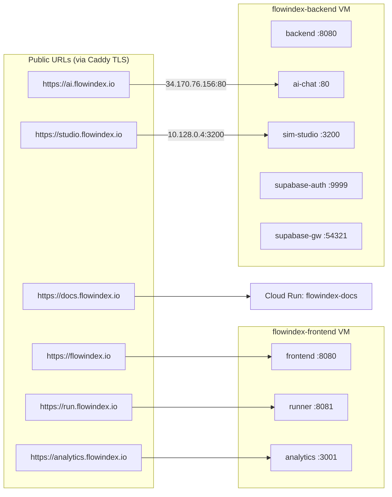
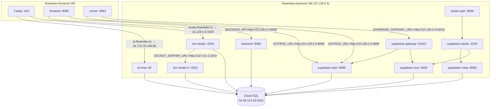

# FlowIndex Infrastructure & Project Map

## Overall Architecture (Mermaid)



---

## Domain Routing (Caddy on `flowindex-frontend` VM)



---

## Project Directory Map

```
flowscan-clone/
├── backend/                 # Go 1.24 — Indexer + REST/WS API
│   ├── main.go              # Entry: forward/backward ingesters + API server
│   ├── schema_v2.sql        # PostgreSQL schema (auto-migrated)
│   ├── Dockerfile           # Multi-stage Go build
│   └── internal/
│       ├── api/             # 43 files — REST handlers, WebSocket, admin, AI
│       ├── ingester/        # 36 files — Block fetching, 12 worker types
│       ├── repository/      # 37 files — PostgreSQL queries, batch insert
│       ├── flow/            # Flow SDK gRPC client wrapper
│       ├── models/          # Go data structs
│       ├── config/          # Env var parsing
│       ├── eventbus/        # In-memory pub/sub
│       └── webhooks/        # Webhook delivery
│
├── frontend/                # React 19 + TanStack Start (SSR via Nitro)
│   ├── app/routes/          # File-based routing (blocks, tx, accounts, developer)
│   ├── app/components/      # Shadcn/UI + domain components
│   ├── app/api/gen/         # OpenAPI-generated API client
│   ├── Dockerfile           # Bun build → Nginx + Nitro
│   ├── Caddyfile            # Production TLS routing config
│   └── nginx.conf           # Container internal reverse proxy
│
├── runner/                  # Cadence Playground — Monaco + AI + FCL
│   ├── src/components/      # Editor, KeyManager, AIPanel, WalletButton
│   ├── src/editor/          # Cadence LSP integration
│   ├── Dockerfile           # Bun + Vite build
│   └── vite.config.ts       # Monaco + LSP WebSocket proxy
│
├── devportal/               # API Docs — Next.js 16 + Fumadocs + Scalar
│   ├── app/                 # Docs pages, API reference, API explorer
│   ├── Dockerfile           # Bun build → Node.js serve
│   └── source.config.ts     # Fumadocs configuration
│
├── studio/                  # Sim Studio Integration (forked)
│   ├── fork/patches/        # Git patches applied to upstream Sim Studio
│   ├── seed/                # PostgreSQL seed data for simstudio DB
│   ├── Dockerfile           # Nginx auth proxy (studio-auth)
│   └── nginx.conf           # Basic auth + reverse proxy to Studio
│
├── ai/chat/                 # AI Chat — Python + Next.js + MCP
│   ├── server.py            # FastAPI backend (chat, sessions)
│   ├── mcp_server.py        # MCP: SQL queries, Cadence exec, schema
│   ├── train.py             # Vanna AI SQL training
│   ├── web/                 # Next.js chat UI
│   ├── Dockerfile           # Python + Nginx + Supervisor
│   └── training_data/       # SQL examples for AI training
│
├── supabase/                # Auth Infrastructure
│   ├── migrations/          # Passkey auth, user keys, projects tables
│   ├── functions/           # Deno edge functions (3 services)
│   │   ├── passkey-auth/    # WebAuthn passkey registration/auth
│   │   ├── flow-keys/       # Encrypted Flow key management
│   │   └── runner-projects/ # Project CRUD for Runner
│   └── gateway/nginx.conf   # Nginx routing for all Supabase services
│
├── docs/                    # Design docs, research, plans
│   ├── architecture/        # ADRs, schema plans, performance analysis
│   ├── operations/          # Runbooks, env config, deploy guides
│   ├── plans/               # 26+ dated design documents
│   └── research/            # Technical research
│
├── scripts/                 # Ad-hoc Python/Bash utilities
├── sdk/typescript/          # TypeScript SDK (placeholder)
├── nft/                     # NFT module (placeholder)
├── output/                  # Playwright E2E tests
│
├── docker-compose.yml       # 18-service local dev stack
├── .env.example             # Config template (secrets, JWT, SMTP)
├── openapi-v1.json          # API spec v1 (300KB)
├── openapi-v2.json          # API spec v2 (263KB)
└── .github/workflows/
    ├── ci.yml               # PR: Go test + Bun lint/build
    └── deploy.yml           # Push to main → selective GCP deploy
```

---

## GCP Infrastructure Detail



### GCE VM IPs (internal)

| VM | Internal IP | Role |
|---|---|---|
| `flowindex-frontend` | (primary, Caddy public) | TLS, frontend, runner |
| `flowindex-backend` | `10.128.0.4` | Backend, AI, Studio, Supabase |

### Cloud SQL

| Property | Value |
|---|---|
| Instance | `flowscan-db` |
| Engine | PostgreSQL 16 |
| Region | us-central1-c |
| Public IP | `34.69.114.28` |
| Databases | `flowscan` (chain data), `supabase` (auth), `simstudio` (Sim Studio) |
| User | `flowscan` |

### Artifact Registry

```
us-central1-docker.pkg.dev/flowindex-mainnet/flowindex/
├── backend:latest
├── frontend:latest
├── runner:latest
├── docs:latest
├── ai-chat:latest
├── studio:latest
├── simstudio-fork:latest
├── simstudio-fork-realtime:latest
└── simstudio-fork-migrations:latest
```

---

## Railway (Staging / Alternative)

Railway is configured as an optional staging environment. All services use the same Docker images with Railway-specific env vars.



**Key Differences from GCP:**
- Uses Railway's internal networking (`*.railway.internal`)
- Single Postgres instance (no Cloud SQL)
- No Supabase/auth stack (not yet deployed on Railway)
- No Sim Studio or AI Chat
- Ideal for quick validation of raw ingestion pipeline

---

## CI/CD Pipeline



### Deploy Targets

| Service | Target | Method |
|---|---|---|
| `backend` | `flowindex-backend` VM | SSH → docker pull + restart |
| `frontend` | `flowindex-frontend` VM | SSH → docker pull + restart + Caddy reload |
| `runner` | `flowindex-frontend` VM | SSH → docker pull + restart |
| `docs` | Cloud Run: `flowindex-docs` | `deploy-cloudrun` action |
| `ai-chat` | `flowindex-backend` VM | SSH → docker pull + restart |
| `studio` | `flowindex-backend` VM | SSH → docker pull + restart (4 containers) |
| `sim-studio` | `flowindex-backend` VM | SSH → migrations + seed + restart (3 containers) |

---

## Data Flow



---

## Worker Types (12)

| Worker | Table(s) Written | Purpose |
|---|---|---|
| `main_ingester` | `raw.blocks`, `raw.transactions`, `raw.events` | Core block/tx/event ingestion |
| `token_worker` | `app.token_transfers`, `app.ft_tokens` | FT/NFT transfer extraction |
| `evm_worker` | `raw.evm_transactions`, `raw.evm_logs` | EVM transaction parsing |
| `meta_worker` | `app.address_transactions`, `app.account_keys` | Address activity, key state |
| `accounts_worker` | `app.accounts` | Account metadata aggregation |
| `ft_holdings_worker` | `app.ft_holdings` | Fungible token balances |
| `nft_ownership_worker` | `app.nft_items` | NFT ownership tracking |
| `token_metadata_worker` | `app.ft_tokens`, `app.nft_collections` | Token/collection metadata |
| `tx_contracts_worker` | `app.tx_contracts` | Transaction→contract mapping |
| `tx_metrics_worker` | `app.tx_metrics` | Transaction metrics/analytics |
| `staking_worker` | `app.staking_*` | Staking data extraction |
| `defi_worker` | `app.defi_*` | DeFi protocol data |

---

## Tech Stack Summary

| Layer | Technology |
|---|---|
| **Backend** | Go 1.24, PostgreSQL 16, pgx, Flow SDK, Gorilla Mux/WS |
| **Frontend** | React 19, TypeScript, TanStack Start, Nitro, Vite, Tailwind, Shadcn/UI |
| **Runner** | React 19, Monaco Editor, Cadence LSP, FCL, AI SDK |
| **Dev Portal** | Next.js 16, Fumadocs, Scalar API Reference |
| **AI Chat** | Python 3.12, FastAPI, Anthropic SDK, Vanna, FastMCP, Next.js |
| **Sim Studio** | Forked simstudioai/sim, Next.js, Drizzle ORM, Better Auth |
| **Auth** | Supabase GoTrue v2.170.0, PostgREST, Deno edge functions |
| **Infra** | GCP (GCE, Cloud SQL, Cloud Run, Artifact Registry), Docker |
| **CI/CD** | GitHub Actions, Workload Identity Federation |
| **TLS** | Caddy (auto HTTPS) |
| **Staging** | Railway (optional) |

---

## Complete Service Port & URL Map

### Public Domains (External Access)



### Per-VM Container Port Inventory

#### VM: `flowindex-frontend` (Caddy + public-facing services)

| Container | Internal Port | External Port / Route | Public URL | Notes |
|---|---|---|---|---|
| **caddy** | 80, 443 | 80, 443 | All `*.flowindex.io` | TLS termination, auto HTTPS |
| **frontend** | 8080 | via Caddy | `https://flowindex.io` | Nginx inside → Nitro SSR, proxies `/api`→backend, `/auth`→GoTrue |
| **runner** | 8081 | via Caddy | `https://run.flowindex.io` | Nginx inside → Vite SSR, proxies `/auth`→GoTrue via `10.128.0.4:9999` |
| **analytics** | 3001 | via Caddy | `https://analytics.flowindex.io` | devportal (Next.js), local-only |

#### VM: `flowindex-backend` (10.128.0.4, backend + infra services)

| Container | Internal Port | External Port | Public URL | Notes |
|---|---|---|---|---|
| **backend** | 8080 | `--network=host` | via frontend proxy `/api` | Go indexer + REST + WebSocket |
| **ai-chat** | 80 (nginx) | `--network=host` | `https://ai.flowindex.io` | Caddy on FE VM proxies to `34.170.76.156:80` |
| **sim-studio** | 3200 | `--network=host` | `https://studio.flowindex.io` | Caddy on FE VM proxies to `10.128.0.4:3200` |
| **sim-studio-realtime** | 3202 | `--network=host` | (internal only) | WebSocket for Sim Studio |
| **supabase-auth** (GoTrue) | 9999 | `--network=host` | via frontend `/auth` proxy | JWT auth, email signup |
| **supabase-gateway** (Nginx) | 54321 | `--network=host` | (internal only) | Routes to auth/rest/functions |
| **supabase-rest** (PostgREST) | 3000 | `--network=host` | (internal only) | REST API to supabase DB |
| **supabase-meta** | 8086 | `--network=host` | (internal only) | Postgres metadata UI |
| **supabase-studio** | 3100 | `--network=host` | (internal only) | Supabase Studio web UI |
| **studio-auth** (Nginx) | 8000 | `--network=host` | via Caddy (basic auth gate) | HTTP basic auth → supabase-studio |
| **passkey-auth** (Deno) | (dynamic) | `--network=host` | via supabase-gateway | WebAuthn passkey edge function |
| **flow-keys** (Deno) | (dynamic) | `--network=host` | via supabase-gateway | Encrypted key management |
| **runner-projects** (Deno) | (dynamic) | `--network=host` | via supabase-gateway | Runner project CRUD |

#### Cloud Run

| Service | Port | Public URL | Notes |
|---|---|---|---|
| **flowindex-docs** | 8080 | `https://docs.flowindex.io` | Managed by Cloud Run, auto-scaled |

#### Cloud SQL

| Database | Host | Port | Used By |
|---|---|---|---|
| `flowscan` | 34.69.114.28 | 5432 | backend (chain data) |
| `supabase` | 34.69.114.28 | 5432 | supabase-auth, PostgREST, edge functions |
| `simstudio` | 34.69.114.28 | 5432 | sim-studio, sim-studio-realtime |

### Internal Network Connections



### Local Development Port Map (docker-compose)

| Service | Host Port | Container Port | URL |
|---|---|---|---|
| **db** (PostgreSQL) | 5432 | 5432 | `localhost:5432` |
| **backend** | 8080 | 8080 | `http://localhost:8080` |
| **frontend** | 5173 | 8080 | `http://localhost:5173` |
| **supabase-db** | 5433 | 5432 | `localhost:5433` |
| **supabase-auth** | 9999 | 9999 | `http://localhost:9999` |
| **supabase-rest** | 3000 | 3000 | `http://localhost:3000` |
| **supabase-gateway** | 54321 | 8000 | `http://localhost:54321` |
| **studio-auth** | 8000 | 80 | `http://localhost:8000` |
| **docs** | 3001 | 8080 | `http://localhost:3001` |
| **passkey-auth** | (internal) | — | via supabase-gateway |
| **flow-keys** | (internal) | — | via supabase-gateway |
| **runner-projects** | (internal) | — | via supabase-gateway |
| **supabase-meta** | (internal) | 8080 | (no public port) |
| **supabase-studio** | (internal) | — | via studio-auth |

### Railway Port Map (Staging)

| Service | Internal URL | External URL | Port |
|---|---|---|---|
| **backend** | `backend.railway.internal:8080` | `<auto>.up.railway.app` | 8080 |
| **frontend** | — | `<auto>.up.railway.app` | 8080 |
| **docs** | — | `<auto>.up.railway.app` | 8080 |
| **Postgres** | Railway managed | — | 5432 |
