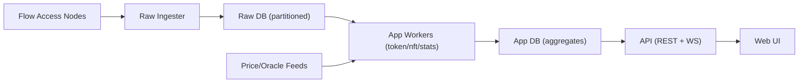

# 对标 FlowScan.io 的差距与调整建议（2026-02-04）

## 结论摘要
- **Raw DB 设计可继续沿用**：现有 `raw` + `app` 分层、分区与恢复机制适用于 10TB+ 规模。
- **差距主要在 App DB、聚合层和 UI/API**：FlowScan.io 的高级模块（Tokens/NFT/Analytics/Nodes/Scheduled/Tokenomics）需要新增或强化 App 层数据与接口。
- **优先补齐：Token/NFT/Contracts/Analytics/Nodes + 搜索与缓存**，可快速对齐用户感知功能。

## 对标范围
- 交易/区块/账户/合约
- Token / NFT 浏览与详情
- Analytics / Tokenomics / Nodes / Scheduled
- 搜索与实时推送
- 性能与可扩展性（历史回填、聚合查询、缓存）

## 功能差距矩阵
| 模块 | FlowScan.io | 我们当前（代码与页面） | 需要补齐 / 调整 |
| --- | --- | --- | --- |
| 搜索 | 统一搜索入口 | 首页搜索（高度/tx/address 规则路由） | 增加模糊搜索与建议、支持合约/Token/NFT |
| 区块/交易 | 列表+详情+分页 | 已有列表+详情 | 优化分页性能、增加过滤/排序 |
| 账户 | 列表+详情+统计 | 账户详情（交易/转账/合约） | 增加账户列表页与标签/排行榜 |
| 合约 | 合约列表+详情 | 仅账户合约查询 | 增加合约目录、合约详情与调用统计 |
| Token (FT) | 代币列表+详情+统计 | 未实现 | 新增 FT 目录、价格/流通量/持有人 |
| NFT | 集合列表+详情 | 未实现 | 新增 NFT 集合与 Item 明细 |
| Analytics | 图表/趋势 | 基础统计（首页/Stats） | 补齐交易/账户/活跃度趋势 |
| Tokenomics | 供应/流通量/分布 | 未实现 | 补齐链上供给统计与分布 |
| Nodes | 节点列表/状态 | 未实现 | 补齐节点监控与角色分类 |
| Scheduled | 预约交易 | 未实现 | 新增 scheduled_tx 模块 |
| 实时推送 | 页面实时更新 | 已有 WebSocket 推送 | 需要扩展事件类型与订阅粒度 |

## 推荐架构调整（App DB 扩展为主）
现有 Raw DB 继续保留，新增 App DB 聚合表与查询索引即可支撑对标功能。

## 建议新增/扩展的 App 表（示例）
- `app.tokens`：FT 代币目录（symbol/decimals/total_supply/holder_count）
- `app.token_price_daily`：价格/市值/流通量历史
- `app.nft_collections`：NFT 集合信息（name, floor, volume）
- `app.nft_items`：NFT item 元数据与归属
- `app.nft_transfers`：NFT 交易与转移
- `app.contracts`：合约目录与元信息
- `app.contract_calls_daily`：合约调用聚合
- `app.node_status`：节点在线/角色/性能指标
- `app.scheduled_txs`：预约交易状态
- `app.search_index`：统一搜索索引（address/hash/contract/token/nft）

## API / 查询层调整
- **统一 cursor 分页**：所有列表型 API 返回 `items + next_cursor`，避免大 offset 扫描。
- **缓存热点**：首页 stats、最新区块/交易、token 列表用短 TTL 缓存。
- **预聚合**：日级统计、账户/合约趋势用周期任务预计算。
- **索引策略**：面向查询路径补齐组合索引（block_height DESC, timestamp DESC, address）。

## UI 对标路径（优先级建议）
1. Token/NFT 列表 + 详情（对用户感知最强）
2. 合约目录 + 合约详情
3. Analytics/Tokenomics 统计图表
4. Nodes/Scheduled 等高级模块

## 与 FlowScan.io 对齐的最小改动结论
- **Raw DB 结构不必大改**，重点是补齐 App DB 聚合与前端模块。
- **历史回填与实时索引分工清晰**：实时链上数据进入 Raw，App Worker 异步聚合。
- **可扩展性依赖于分区与预聚合**：当前 schema 方向正确，可在 App 层继续扩展。

