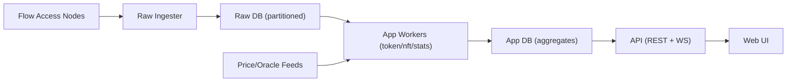

# Gap Analysis vs FlowScan.io (2026-02-04)

## Summary
- **Raw DB design can stay as-is:** the current `raw` + `app` split, partitions, and resumability are appropriate for 10TB+ scale.
- **Gaps are mostly in App DB, aggregation, and UI/API:** FlowScan.io advanced modules (Tokens/NFT/Analytics/Nodes/Scheduled/Tokenomics) require additional app-layer tables and endpoints.
- **Priority to close:** Token/NFT/Contracts/Analytics/Nodes + search and caching.

## Scope
- Transactions / Blocks / Accounts / Contracts
- Token / NFT browsing and details
- Analytics / Tokenomics / Nodes / Scheduled
- Search and real-time updates
- Performance and scalability (backfill, aggregates, caching)

## Feature Gap Matrix
| Module | FlowScan.io | Current State | Needed |
| --- | --- | --- | --- |
| Search | Unified search | Homepage routing by height/tx/address | Fuzzy search, suggestions, support contract/token/NFT |
| Blocks/Tx | List + detail + pagination | Implemented | Faster pagination, filters, sorting |
| Accounts | List + detail + stats | Account detail only | Add accounts list + labels/rankings |
| Contracts | List + detail | Account-based contract view only | Contract directory + stats |
| Token (FT) | List + detail + stats | Not implemented | FT directory, price, supply, holders |
| NFT | Collections + detail | Not implemented | Collections + items |
| Analytics | Charts + trends | Basic stats (Home/Stats) | Add tx/account/activity trends |
| Tokenomics | Supply/circulation | Not implemented | Supply + distribution stats |
| Nodes | Node list/status | Not implemented | Node monitoring + role categories |
| Scheduled | Scheduled tx | Not implemented | Scheduled tx module |
| Realtime | Live updates | WebSocket updates | Expand events + subscription granularity |

## Recommended Architecture Adjustments (App DB Focus)
Keep Raw DB intact and expand App DB aggregates and indexes.

## Suggested App Tables (Examples)
- `app.tokens` — FT catalog (symbol/decimals/total_supply/holder_count)
- `app.token_price_daily` — price/marketcap/supply history
- `app.nft_collections` — collection metadata (name, floor, volume)
- `app.nft_items` — NFT item metadata and ownership
- `app.nft_transfers` — NFT transfers
- `app.contracts` — contract catalog and metadata
- `app.contract_calls_daily` — contract call aggregates
- `app.node_status` — node online/role/performance
- `app.scheduled_txs` — scheduled tx states
- `app.search_index` — unified search index (address/hash/contract/token/nft)

## API / Query Layer Adjustments
- **Cursor pagination:** `items + next_cursor` for all list endpoints.
- **Hot cache:** short TTL cache for homepage stats, latest blocks/txs, token lists.
- **Pre-aggregation:** daily stats for long-range trends.
- **Indexes:** composite indexes aligned with query paths (`block_height DESC`, `timestamp DESC`, `address`).

## UI Roadmap (Suggested Order)
1. Token/NFT lists + detail
2. Contract directory + contract detail
3. Analytics/Tokenomics charts
4. Nodes / Scheduled

## Minimal Change Conclusion
- **Raw DB structure does not need a major change.** Focus on App DB aggregation and frontend modules.
- **Live vs history is already well separated:** raw ingestion writes to `raw`, workers populate `app`.
- **Scalability depends on partitions + pre-aggregation:** current schema direction is sound, extend in App layer.
