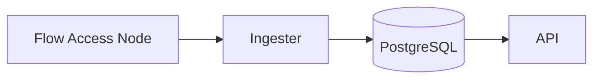
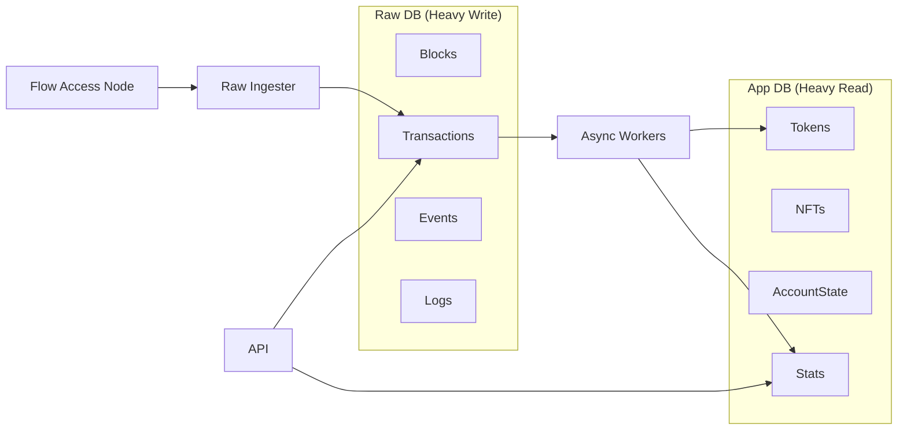

# FlowScan Backend — Schema V2 & Architecture Refactor Plan (Rewritten)

## Goal
Prepare the backend to scale to **10TB+ of chain data** while improving:

- **Performance**: sustained high write throughput + predictable read latency  
- **Stability**: isolate failure domains; reduce operational footguns  
- **Resumability**: safe restart, re-run, and backfill without duplicates or corruption  
- **Extensibility**: add new derived indexes/workers without changing the raw ingest path

**Guiding principle**: *Raw ingestion must never be blocked by downstream processing.*

---

## 0) Current Context & Assumptions

- Current DB size: ~60GB.
- Target scale: 10TB+ (raw + derived cumulative).
- Flow chain is mostly “append-only” from the perspective of **sealed** blocks.
- Most “big” tables are naturally ordered by **block_height**.
- Deployment target: **GCP** (Cloud SQL for Postgres, GCS for large payload offload).
- Migration approach: **Drop & Recreate** is acceptable.

**Non-goals**
- We are not optimizing for cross-DB joins.
- We will not guarantee “exactly-once” processing via distributed transactions; instead we use **idempotency + checkpoints + leasing**.

---

## 1) Architecture Overview

### 1.1 Components
1. **Raw Ingester (must be rock-solid)**
   - Pull sealed blocks/transactions/events from Flow Access Node
   - Write to **Raw Store**
   - Maintain `raw_ingester` checkpoint only
   - No derived logic, no heavy reads, no business rules

2. **Async Workers (optional, can be paused)**
   - Read from raw tables (or from a lightweight queue)
   - Produce derived/state tables: tokens, EVM decoding, stats, search index, etc.
   - Each worker has independent checkpoint(s)

3. **API / Query Layer**
   - Reads primarily from **App/Derived Store**
   - When needed: fetch detail from Raw Store


### 1.2 Architecture Diagrams

#### Current Architecture (Monolithic)


#### Proposed Architecture (Dual-DB Async Pipeline)


---

## 2) Storage Strategy: Dual-Connection, Optional Physical Split

### 2.1 Logical Split (recommended immediately)
Backend accepts two DSNs:

- `DB_RAW_URL`: raw append-only data (heavy writes)
- `DB_APP_URL`: derived/state/index data (heavy reads + mixed writes)

**Phase 1**: both URLs can point to the same physical Postgres instance (two schemas or two databases).  
**Phase 2**: when ingestion contention appears, move `DB_APP_URL` to a separate DB/instance.  
**Phase 3 (optional)**: move analytics to OLAP (ClickHouse/BigQuery) if needed.

### 2.2 Why this works well
- **Isolation**: app queries and heavy derived calculations cannot slow raw ingestion.
- **Operational flexibility**: easy to pause all workers, keep raw ingestion healthy.
- **Scaling path**: raw store can grow to 10TB+ without dragging app query latency.

### 2.3 Cross-DB Join Tradeoff
We accept loss of `JOIN(raw.tx, app.token_transfer)` across DBs.

Mitigation:
- Store “link fields” redundantly in App DB where needed (e.g., `block_height`, `block_timestamp`, `tx_id`, `payer`, etc.).
- API pattern: *list from App DB → detail from Raw DB*.

### 2.4 GCP Deployment Defaults (Decision)
- **Postgres:** Cloud SQL (single instance to start), with `raw` and `app` as separate databases or schemas.
- **Object Storage:** GCS bucket for large payload offload (`payload_ref` points to GCS object key).
- **Compute:** Run `raw_ingester` and workers as separate services (Cloud Run jobs or GKE), API as a separate service.
- **Connection Limits:** Enforce bounded pools per service (`max_open_conns`, `max_idle_conns`) to protect Cloud SQL.

---

## 3) Partitioning Strategy (Raw & Large Derived Tables)

### 3.1 Partitioning Goals
- Improve write locality and reduce index bloat pressure per table segment
- Enable query pruning by height ranges
- Support lifecycle policies (cold partitions, retention, compression strategies later)

### 3.2 Partition Size Recommendation (change from 1M default)
Using **1,000,000 blocks/partition** yields ~141 partitions already — and with 7+ partitioned tables this becomes ~1,000 partitions plus indexes.

Recommended starting sizes:
- **blocks**: 5,000,000 / partition  
- **transactions**: 5,000,000 / partition (10,000,000 if needed)
- **events** (highest volume): 10,000,000 / partition
- **execution_results**: 5,000,000 / partition
- **collections**: 5,000,000 / partition
- **token_transfers**: 10,000,000 / partition
- **evm_transactions / evm_logs**: 10,000,000 / partition

This reduces partitions per table from ~141 to ~15–29 and drastically lowers operational complexity.

### 3.3 Partition Creation Policy (avoid pre-creating hundreds)
- Create partitions **on demand** based on current height.
- Always ensure:
  - Current partition exists
  - A small lookahead (e.g., next 2 partitions) exists

This can be done at process start or via a small periodic “partition manager”.

---

## 4) Schema V2: Table Classification

### 4.1 Partitioned (Linear Growth)
**Raw DB**
- `blocks` (partitioned by `height`)
- `transactions` (partitioned by `block_height`)
- `events` (partitioned by `block_height`)
- `collections` (partitioned by `block_height`)
- `execution_results` (partitioned by `block_height`)

**Derived DB**
- `token_transfers` (partitioned by `block_height`)
- `evm_transactions` / `evm_logs` (partitioned by `block_height`)

### 4.2 State / Lookup (Non-partitioned or selective partitioning)
- `account_keys` (large lookup; consider normal btree first; hash partition later only if needed)
- `smart_contracts`
- `address_stats`
- `nft_metadata`
- `tokens`, `nft_collections`, `search_index` etc.

---

## 5) Keys, Indexing, and Pagination

### 5.1 Idempotency Keys (must-have)
To support safe retries and restarts, raw and derived inserts must be idempotent.

Examples:
- blocks: `PRIMARY KEY (height)`
- transactions: `PRIMARY KEY (block_height, id)` (Postgres requires PK to include partition key)
- events: `PRIMARY KEY (block_height, transaction_id, event_index)`
- token_transfers: `PRIMARY KEY (block_height, transaction_id, event_index)`
- evm logs: `PRIMARY KEY (block_height, transaction_id)` (partitioned by height)

Use `INSERT ... ON CONFLICT DO NOTHING/UPDATE` as appropriate.

### 5.2 Global Lookups (The "Where ID=?" Solution)
Since partitioned tables lack a global index, `WHERE id = ?` queries scan all partitions.
**Strategy**: Maintain a lightweight Lookup Table for fast ID resolution.

- `raw.tx_lookup(id PK, block_height, tx_index, timestamp, evm_hash nullable)`
- `raw.block_lookup(id PK, height, timestamp)`

**Atomic Consistency Rule**:
- The `raw_ingester` MUST update/insert `tx_lookup` in the **SAME TRANSACTION** as the `transactions` insert.
- `raw.transactions` uses `ON CONFLICT (block_height, id) DO UPDATE SET ...` (update deterministic fields to support backfill/healing).
- `raw.tx_lookup` and `raw.block_lookup` use `ON CONFLICT(id) DO UPDATE SET ...` to ensure lookups are authoritative and self-healing.
- Never allow a state where Lookup exists but Partition data is missing (or vice-versa).

**EVM Hash Support**:
- If EVM hash is extracted, store in `raw.tx_lookup.evm_hash` with a unique index on `evm_hash` (nullable).
- API lookup path: normalize hash input → check `evm_hash` first → fall back to Flow tx id.

### 5.3 Surrogate `internal_id` (optional, careful)
We may add `internal_id BIGSERIAL` for convenience and faster joins, but:
- **Do not remove** tx/event hash keys as authoritative identifiers.
- **NOT for ordering**: `internal_id` does not guarantee chain order. Pagination MUST use `(block_height, transaction_index, id)`.

### 5.4 Pagination
Avoid OFFSET scans.

Recommended cursor patterns:
- Transactions: `(block_height, transaction_index, id)` cursor
- Events: `(block_height, transaction_id, event_index)` cursor
- Token transfers: `(block_height, transaction_id, event_index)` cursor

Ensure composite indexes align with these patterns.

### 5.5 Index strategy by phase
**Backfill phase**
- Keep only essential unique constraints + a minimal set of indexes.
- Defer secondary indexes until partition is fully backfilled, then build per-partition indexes.

**Steady state**
- Add read-optimized indexes required by API usage.

### 5.6 Required Keys & Indexes (Minimal Set)
- `raw.blocks`: `PRIMARY KEY (height)`; `raw.block_lookup` is authoritative for `block_id` lookup.
- `raw.transactions`: `PRIMARY KEY (block_height, id)`; index `(block_height, transaction_index)`; `raw.tx_lookup` is authoritative for `id/evm_hash` lookup.
- `raw.events`: `PRIMARY KEY (block_height, transaction_id, event_index)`; index `(block_height, transaction_id)`.
- `app.token_transfers`: `PRIMARY KEY (block_height, transaction_id, event_index)`; index `(from_address, block_height)`, `(to_address, block_height)`, `(token_contract_address, block_height)`.
- `app.nft_transfers`: `PRIMARY KEY (block_height, transaction_id, event_index)`; index `(from_address, block_height)`, `(to_address, block_height)`, `(token_contract_address, block_height)`.
- `app.address_transactions`: `PRIMARY KEY (address, block_height, transaction_id)`; index `(address, block_height DESC)`.
- `app.indexing_checkpoints`: `PRIMARY KEY (worker_name)`.
- `app.worker_leases`: `UNIQUE (worker_type, from_height)`.

---

## 6) Async Workers: Progress Tracking, Work Allocation, and Resumability

### 6.1 Checkpoints (per worker)
A single checkpoint is insufficient. We track progress per worker:

- `raw_ingester`
- `token_worker`
- `evm_worker`
- `stats_worker`
- future workers: `nft_worker`, `search_worker`, etc.

Each worker checkpoint includes:
- last processed `block_height` (**Contiguous Watermark** only).
- **Rule**: Checkpoint must only advance when a *contiguous range* from the previous checkpoint is complete.
- **Mechanism**: A "Committer" or Leader process updates the checkpoint based on completed Leases to avoid holes.
- **Committer Rule**: Start from current checkpoint; advance ONLY if next range (`checkpoint` to `checkpoint+RANGE`) is `COMPLETED`. **Forbidden**: Do NOT use `MAX(to_height)` to jump gaps.
- `updated_at`

### 6.2 Work Allocation (avoid race/duplicate storms)
Workers should not “just scan transactions” in an uncoordinated way.

We introduce a lightweight **work leasing** table per worker type:

- worker claims a height range (e.g., [H, H+50k)) with a `lease_expires_at`

**Claim Protocol: Option B (Dynamic INSERT-on-Claim)**
*Preferred for infinite streams.*

**1. Range Definition**:
- **Range Size**: Configurable (default `50,000` blocks).
- **Alignment**: `from_height` MUST be a multiple of `RANGE_SIZE`. `to_height = from_height + RANGE_SIZE`.
- **Candidate Selection**:
    1. Start at `floor(checkpoint / RANGE_SIZE) * RANGE_SIZE`.
    2. Priority: Reclaim `FAILED` ranges (attempt < 5) first.
    3. Fallback: If no FAILED ranges, try `INSERT` next sequential range (`+ RANGE_SIZE`).

**2. Claim Protocol (Active & Reclaim)**:
Worker attempts to acquire a range.
*Step A: Try Insert (New Range)*
```sql
INSERT INTO app.worker_leases(...) VALUES (...) ON CONFLICT DO NOTHING RETURNING id;
```
*Step B: Try Reclaim (Failed Range)*
If Insert fails, check if we can reclaim a FAILED range:
```sql
UPDATE app.worker_leases 
SET leased_by=?, lease_expires_at=..., status='ACTIVE' 
-- NOTE: Do NOT increment attempt here. Only Reaper increments attempt. 
WHERE worker_type=? AND from_height=? AND status='FAILED' AND attempt < 5
RETURNING id;
```

**3. Reaper Strategy**:
- **Action**: Identify expired `ACTIVE` leases.
- **Transition**: Set `status='FAILED'`, `attempt = attempt + 1`.
- **Max Retries**: If `attempt >= 5`, log "POISON PILL" error and do NOT reset. Admin intervention required.

**Resuability**:
- processes range idempotently
- commits completion (`UPDATE status='COMPLETED'`) and advances checkpoint
- if worker dies, lease expires; Reaper moves to FAILED; Worker picks up FAILED (if attempts < 5) or waits for Reaper to reset.

This enables:
- safe concurrency scaling
- controlled retries
- predictable resumability

### 6.3 Payload Storage Policy (10TB Rule)
To avoid "storage death by JSON", we strictly enforce:
1. **Raw Table**: Only store necessary raw bytes. Truncate strictly non-essential padding.
    - **Threshold**: If payload > **8KB**, MUST store hash only + offload full body to Object Storage (S3/GCS).
    - **Standard Schema**: Tables with potentially large payloads (`raw.events`, `app.evm_logs`) MUST include:
        - `payload_hash VARCHAR` (SHA-256)
        - `payload_ref VARCHAR` (URL/Key, nullable)
        - `payload` JSONB (nullable, null if offloaded)
2. **No GIN on Raw**: **PROHIBITED** to create GIN indexes on `raw.events.payload` or `raw.transactions.arguments`. These are for storage only.
    - Derived queries MUST use `app` tables (e.g., `app.token_transfers`) with structured columns.
3. **Large Payloads**:
    - Consider hashing (`sha256(script)`) and storing in a separate `scripts` mapping table.
    - Schema Convention: `raw.scripts(script_hash PK, script_text, created_at)` and `app.contract_code(code_hash PK, code_text)`.

### 6.4 Denormalization Policy (10TB Guardrail)
- **Do not** store full event lists inside `raw.transactions` in production.
- Store `event_count` and small summaries only (or keep raw only in `raw.events`).
- If needed for debugging, gate it behind `DENORMALIZE_EVENTS=true` and truncate to a safe size.

### 6.5 API Query Rules
- **Show Raw Restriction**: ALL "Show Raw" endpoints MUST first Lookup ID -> Get Height -> Select from Partition `(height, id)`. Scanning partitions is forbidden.
- **No GIN for Online API**: Online API queries MUST NOT rely on JSONB path operations (`->>`) on raw tables.
- **Structure First**: Always query structured columns in `app` tables (e.g., `app.token_transfers.amount`).
- **Raw as Fallback**: Raw JSONB is only for offline debugging, backfilling, or specific "Show Raw" endpoints that query by ID only.

### 6.6 Reorg / Parent Mismatch Handling
- Ingest **sealed** blocks only, but still verify `parent_id` continuity.
- If `parent_id` mismatch is detected, rollback to the last matching height and re-ingest from there.
- Cap rollback to `MAX_REORG_DEPTH` (default 1000). If exceeded, **halt ingestion** and require manual intervention.
- Rollback must delete **raw + derived** rows above the rollback height and reset checkpoints.

### 6.7 Consistency Repair Jobs
Nightly (or on-demand) reconciler performs:
- `raw.tx_lookup` rows missing in `raw.transactions` → re-fetch or delete lookup.
- `raw.transactions` rows missing in `raw.tx_lookup` → backfill lookup.
- `raw.block_lookup` vs `raw.blocks` mismatch → backfill lookup.


---

## 7) Error Tracking and Observability

### 7.1 `indexing_errors` table (recommended)
Keep it, but add guardrails to prevent runaway growth:

- add `error_hash` (hash of stack/message)
- unique or partial de-dupe: `(worker_name, block_height, transaction_id, error_hash)`  
- index for triage: `(resolved, worker_name, created_at desc)` and `(block_height)`
- store truncated payload: `raw_data` capped (e.g., first N KB) + store full payload in object storage if ever needed

Suggested schema (conceptual):
- `severity`: FATAL/WARN
- `resolved`: bool
- `created_at`
- `raw_ref`: optional pointer to raw payload store

### 7.2 Watermark Reporting
Expose (or at least compute internally):
- `raw_tip_height`
- `worker_tip_height` per worker
- `app_watermark_height = min(all required workers)`

**Required Workers Set**:
Define critical path per API (e.g., `/tokens` requires `token_worker`; `/stats` requires `stats_worker`).
API responses should include `meta: { data_watermark: 12345, required_workers: ['token_worker'] }` to help debugging.

API can optionally surface `data_watermark_height` so clients understand freshness.

---

## 8) Ingestion Performance Requirements

### 8.1 Batch Writes
Avoid single-row inserts at scale.

- batch insert by block or by N blocks
- consider `COPY` for backfill
- keep transaction sizes bounded (avoid giant transactions that bloat WAL and lock memory)

### 8.2 Failure handling
- exponential backoff on node/network errors
- circuit breakers to prevent hot loops
- never block raw ingestion on derived processing

---

## 9) Migration Strategy

Given willingness to reset and only ~60GB currently:

### Decision: Drop & Recreate
1. Export minimal metadata if needed (optional)
2. Drop databases / schemas
3. Recreate Raw schema + App schema
4. Start backfill from height 0 (or from a chosen checkpoint)

Pros: cleanest, least risk, aligns with “10TB rules”.

### Fallback: In-place migrate 60GB
1. Rename old tables to `_old`
2. Create new partitioned tables
3. Backfill `INSERT INTO new SELECT FROM old` in batches
4. Validate counts/checksums
5. Drop `_old` tables

Pros: preserves current history; Cons: complexity and time.

---

## 10) Rollout Phases (Recommended)

### Phase 0 — Schema + Partition Manager
- Implement schema V2
- Add partition manager (on-demand + lookahead)
- Add checkpoint tables
- Disable denormalized event blobs in `raw.transactions` (guard behind feature flag only)
- Set up GCS bucket for payload offload + env config (`PAYLOAD_INLINE_MAX_BYTES`)

### Phase 1 — Raw-only Mode (Stability first)
- Run `raw_ingester` only
- Validate sustained throughput and correctness
- Confirm partitions and constraints behave
- **Success Criteria**:
    - [ ] Continuous 24h run without crash-loop.
    - [ ] Lag < 1000 blocks from tip.
    - [ ] Ingestion Error Rate < 0.01%.
    - [ ] DB Write IOPS / CPU within target limits.

### Phase 2 — Enable Workers One by One
- Enable `token_worker` with leasing + checkpoint
- Enable `evm_worker`
- Enable `stats_worker`
- Monitor lag and error rates; keep ability to pause workers

### Phase 3 — Physical Split (when needed)
- Move App DB to separate instance if reads impact writes
- Optionally add OLAP for heavy analytics

---

## 11) Immediate Next Steps Checklist

- [ ] Finalize partition sizes (5M/10M) per table
- [ ] Define deterministic idempotency keys per table (raw + derived)
- [ ] Add `evm_hash` to `raw.tx_lookup` + unique index
- [ ] Implement `indexing_checkpoints` (per worker)
- [ ] Implement worker leasing table(s)
- [ ] Implement `indexing_errors` with de-dupe + truncation
- [ ] Implement partition manager (on-demand + lookahead)
- [ ] Implement parent mismatch rollback (with `MAX_REORG_DEPTH`)
- [ ] Add lookup repair job (tx/block lookup reconciliation)
- [ ] Wire payload offload to GCS + `PAYLOAD_INLINE_MAX_BYTES`
- [ ] Start Phase 1 raw-only backfill and measure throughput
